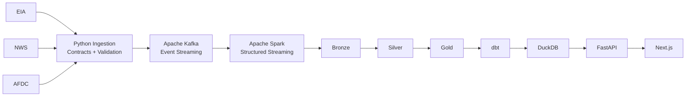

<div align="center">

## Live Demo

**Live Website:** https://gridpulse-intelligence.vercel.app

**Public Analytics API:** https://gridpulse-api-hruthikgavva-5884s-projects.vercel.app

The public portfolio serves a read-only analytical snapshot with retained operational evidence. The full Kafka, Spark, lakehouse, and observability environment remains reproducible locally.


# GRIDPULSE INTELLIGENCE

### **Streaming Data. Grid Intelligence. Observable Engineering.**

A modern data engineering platform built around
**U.S. Electricity, Weather, and EV Infrastructure Data.**

<br>


</div>

---

## WHAT IS GRIDPULSE?

**GridPulse Intelligence** is an end-to-end data engineering and analytics platform I built to explore how a modern data system can connect:

**Ingestion → Streaming → Processing → Analytics → Observability → Product Experience**

The project brings together public electricity, weather, and EV infrastructure data and turns it into an interactive intelligence platform.

I did not want GridPulse to stop at:

> *"The pipeline ran successfully and here is a dashboard."*

I wanted the system to also explain:

- **Where the data came from**
- **How it moved through the platform**
- **Whether the source is fresh**
- **Whether a pipeline succeeded or failed**
- **How many records were processed**
- **How fast the pipeline ran**
- **Where data was filtered or quarantined**
- **What evidence contributed to an analytical signal**
- **Whether data is current or historical replay**

That is what shaped GridPulse.

---

## THE DATA

GridPulse currently works across three public data domains.

### **EIA — ELECTRICITY**

Electricity and balancing-authority data used for:

- Demand Analysis
- Generation Analysis
- Forecast Error
- Historical Grid Behavior
- Regional Grid Pressure
- Balancing Authority Intelligence

### **NWS — WEATHER**

National Weather Service forecast data used for:

- Hourly Temperature
- Precipitation Probability
- Weather Analytics
- Infrastructure Context

### **AFDC — EV INFRASTRUCTURE**

Alternative Fuels Data Center records used for:

- Charging Station Counts
- Charging Port Availability
- City-Level Infrastructure Rankings
- EV Infrastructure Analytics

---

# PLATFORM ARCHITECTURE



At a high level:

```text
PUBLIC APIs
    ↓
PYTHON INGESTION
    ↓
DATA CONTRACTS + VALIDATION
    ↓
APACHE KAFKA
    ↓
SPARK STRUCTURED STREAMING
    ↓
BRONZE → SILVER → GOLD
    ↓
dbt
    ↓
DUCKDB
    ↓
FASTAPI
    ↓
NEXT.JS
```

---

# INTELLIGENCE EXPERIENCE

The frontend is designed as an **Intelligence Platform**, not just a collection of charts.

## **NATIONAL COMMAND CENTER**

The Command Center provides a high-level view across GridPulse.

It brings together:

- **Grid Risk**
- **Regional Load Pressure**
- **Weather**
- **EV Infrastructure**
- **Platform Operations**

Each area connects into a deeper analytical experience.

---

## **U.S. GRID INTELLIGENCE**

GridPulse provides a geographic view of regional electricity behavior across the United States.

The map helps compare regional analytical signals and connects them with historical grid behavior.

> Regional map anchors are analytical representations used by GridPulse.
> They are **not official EIA boundary polygons**.

---

## **GRID TIME MACHINE**

Historical grid intelligence should not disappear once the newest data arrives.

The **Grid Time Machine** allows historical regional conditions to be explored through:

- Play / Pause
- Timeline Scrubbing
- Historical Snapshots
- Multiple Playback Speeds
- Regional Signal Changes

Historical calculations are designed to avoid using future observations when evaluating an earlier point in time.

---

# LIVE ANALYTICS

GridPulse includes three focused analytical experiences.

### **GRID**

Explore:

- Peak Demand
- Balancing Authority Behavior
- Forecast Error
- Historical Grid Signals

### **WEATHER**

Explore:

- Hourly Temperature
- Precipitation Probability
- NWS Forecast Signals

### **EV INFRASTRUCTURE**

Explore:

- Charging Stations
- Charging Ports
- City Infrastructure Rankings

The main navigation can open the appropriate analytics view directly.

---

# EXPLAINABLE GRID RISK

GridPulse produces analytical risk signals using historical electricity behavior.

The balancing-authority model considers signals such as:

- **Demand Deviation**
- **Forecast Error**
- **Generation / Demand Relationships**
- **Historical Baselines**

Signals are normalized into a score and severity classification.

```text
NORMAL
ELEVATED
HIGH
CRITICAL
```

The goal is not only to provide a score.

GridPulse also exposes the **evidence behind the score**.

> GridPulse risk scores are analytical indicators.

They are **not**:

- Utility Outage Alerts
- Emergency Warnings
- Reliability Declarations
- Official Grid Operator Signals

---

# EVENT STREAMING

GridPulse uses **Apache Kafka** as the event backbone.

Current topics include:

```text
gridpulse.eia.region-data.v1

gridpulse.nws.forecast.v1

gridpulse.afdc.ev-stations.v1

gridpulse.dead-letter.v1
```

Events use a common envelope containing information such as:

```text
event_id
source
dataset
event_type
partition_key
emitted_at
source_timestamp
replay
payload
```

This gives downstream systems a consistent structure for validation, replay, routing, and processing.

---

# REPLAY-SAFE PROCESSING

Historical backfills are treated explicitly.

Historical events remain:

```text
replay=true
```

Their original source timestamp is preserved.

GridPulse does **not** convert historical replay into apparent live activity.

That means current and historical data can travel through the same architecture without losing the distinction between them.

---

# DEAD-LETTER HANDLING

Invalid events should not silently disappear.

GridPulse includes a dedicated Kafka dead-letter topic:

```text
gridpulse.dead-letter.v1
```

The processing behavior is intentionally explicit.

### Valid Event

```text
PROCESS
   ↓
COMMIT OFFSET
```

### Invalid Event

```text
VALIDATION FAILURE
       ↓
DEAD-LETTER TOPIC
       ↓
COMMIT OFFSET
```

### Processing Failure

```text
HANDLER FAILURE
      ↓
NO COMMIT
```

GridPulse intentionally does **not** describe these consumer semantics as exactly-once processing.

---

# LAKEHOUSE PROCESSING

The core analytical pipeline follows a familiar layered architecture:

```text
KAFKA
   ↓
BRONZE
   ↓
SILVER
   ↓
GOLD
```

## **BRONZE**

The Bronze Layer preserves event-level source data from the streaming pipeline.

It acts as the raw analytical foundation for downstream processing.

## **SILVER**

The Silver Layer handles:

- Validation
- Normalization
- Domain Transformations
- Deduplication
- Quarantine Handling

Current Silver datasets include:

```text
eia_region_data

nws_hourly_forecast

afdc_ev_stations
```

## **GOLD**

The Gold Layer creates analytical datasets optimized for downstream intelligence.

Gold changes the grain of the data through aggregation.

Because of that:

> **Gold row count is not treated as a direct data-loss comparison with Silver.**

---

# dbt ANALYTICS

GridPulse uses **dbt** to create downstream analytical models.

Current marts include:

```text
mart_grid_hourly

mart_balancing_authority_performance

mart_ev_city_rankings

mart_weather_forecast
```

The EIA respondent hierarchy is also normalized so GridPulse can distinguish:

**Balancing Authorities · Regional Aggregates · National Aggregates**

instead of treating fundamentally different entities as the same thing.

---

# DUCKDB ANALYTICS STORE

GridPulse currently uses **DuckDB** as its analytical serving store.

It provides a fast local analytical layer without requiring a large cloud warehouse just to demonstrate the architecture.

The project was intentionally developed **local-first** before deployment.

---

# PLATFORM OBSERVABILITY

One of the parts of GridPulse I care about most is that the platform can monitor **itself**.

Observability is treated as part of the product rather than hidden entirely in logs.

---

## **PLATFORM HEALTH**

Platform Health exposes the state of important infrastructure and analytical dependencies.

This includes visibility into components such as:

- Kafka
- Analytical Storage
- Prometheus
- Consumer Activity

---

## **DATA FRESHNESS INTELLIGENCE**

GridPulse evaluates how current each data source is.

Possible states include:

```text
FRESH

DELAYED

STALE

UNKNOWN
```

The platform also exposes the timestamp basis used to make the freshness decision.

> Freshness thresholds are **GridPulse operational rules**, not guarantees published by EIA, NWS, or AFDC.

---

# OPERATIONAL INCIDENT INTELLIGENCE

Freshness and runtime evidence can be converted into operational incidents.

An incident may include:

- **Severity**
- **Category**
- **Current State**
- **Evidence**
- **Recommended Action**

The platform surfaces evidence for investigation rather than pretending every issue can be automatically diagnosed or repaired.

---

# PIPELINE LINEAGE

The lineage experience connects the complete GridPulse data path.

```text
PUBLIC SOURCES
      ↓
KAFKA
      ↓
BRONZE
      ↓
SILVER
      ↓
GOLD
      ↓
dbt
      ↓
DUCKDB
      ↓
FASTAPI
      ↓
NEXT.JS
```

Pipeline nodes can include actual runtime evidence instead of being only a static architecture diagram.

---

# PIPELINE EXECUTION TELEMETRY

GridPulse records real pipeline execution information.

A run can include:

- **Status**
- **Start Time**
- **Finish Time**
- **Duration**
- **Exit Code**
- **Records Processed**
- **Throughput**

Operational stages currently include:

```text
Kafka → Bronze Ingestion

Bronze → Silver Transformation

Gold Analytics Build

dbt Analytics Build
```

The portfolio interface shows the latest meaningful state for each stage instead of adding an unlimited number of cards.

Historical run information remains available for operational analysis.

---

## **ZERO RECORDS CAN STILL BE HEALTHY**

A successful streaming execution may legitimately process zero records.

For example:

```text
STATUS       SUCCEEDED
RECORDS      0
EXIT CODE    0
```

may simply mean:

**Kafka has no new offsets and the checkpoint is already current.**

GridPulse preserves that truth rather than fabricating activity.

---

# PIPELINE SLA INTELLIGENCE

GridPulse evaluates pipeline runtime and recency using its own operational rules.

Possible states include:

```text
NO_RUN_DATA
RUNNING
STALLED
FAILED
SUCCEEDED
OVERDUE
UNKNOWN
```

When enough successful history exists, observed execution behavior can help establish expected runtime.

> These are **GridPulse-owned SLAs**, not upstream service guarantees.

---

# DATA QUALITY INTELLIGENCE

GridPulse makes movement between lakehouse layers visible.

The quality layer can report:

- **Bronze Input**
- **Silver Retained**
- **Rows Removed Before Silver**
- **Retention Percentage**
- **Quality Failures**
- **Deduplicated Records**
- **Gold Analytical Rows**

One rule matters throughout the implementation:

> **Unknown is better than invented.**

If the available evidence cannot fully explain a difference, GridPulse does not manufacture an explanation just to make the platform appear healthy.

---

# TECHNOLOGY STACK

| Layer | Technology |
|---|---|
| **Language** | Python 3.12 |
| **Ingestion** | HTTPX, Pydantic |
| **Streaming** | Apache Kafka |
| **Processing** | Apache Spark, Structured Streaming |
| **Lakehouse** | Parquet, Bronze / Silver / Gold |
| **Transformation** | dbt |
| **Analytics Store** | DuckDB |
| **Backend** | FastAPI |
| **Frontend** | Next.js, React, TypeScript |
| **Visualization** | Recharts, D3, TopoJSON, Three.js |
| **Observability** | Prometheus, Grafana |
| **Infrastructure** | Docker, Docker Compose, Terraform |
| **Engineering Quality** | Ruff, mypy, pytest, pre-commit |

---

# REPOSITORY STRUCTURE

```text
gridpulse-intelligence/
│
├── config/
├── contracts/
├── data/
├── dbt/
├── docs/
├── frontend/
├── infrastructure/
├── observability/
├── orchestration/
├── pipelines/
├── quality/
├── scripts/
├── src/
└── tests/
```

Runtime data is intentionally excluded from Git.

That includes:

- Raw Data
- Processed Data
- Quarantine Files
- Spark Checkpoints
- DuckDB Warehouse Files
- Observability Execution Logs

---

# RUNNING LOCALLY

## **Install Dependencies**

```bash
uv sync
```

## **Run Engineering Checks**

```bash
make check
```

The project uses:

**Ruff · mypy · pytest**

for formatting, linting, type checking, and automated tests.

---

## **Start Kafka**

```bash
docker compose \
  -f infrastructure/docker/docker-compose.kafka.yml \
  up -d
```

The local Kafka environment runs in **KRaft mode**.

---

## **Build Analytics**

```bash
make analytics
```

Kafka → Bronze streaming is executed separately so event offsets and checkpoints remain explicit.

---

# PIPELINE TELEMETRY WRAPPER

GridPulse pipeline stages can be executed through the telemetry wrapper:

```bash
uv run python \
  -m gridpulse_intelligence.pipeline_runs \
  --stage <stage-name> \
  -- <command>
```

Pipelines can emit:

```text
GRIDPULSE_RECORDS_PROCESSED=<integer>
```

which allows the telemetry layer to calculate actual processing throughput.

---

# API

GridPulse exposes its intelligence layer through **FastAPI**.

Representative endpoints include:

```text
/health

/api/v1/status

/api/v1/grid/authorities
/api/v1/grid/anomalies
/api/v1/grid/regions
/api/v1/grid/regions/{region}/history
/api/v1/grid/regions/timeline

/api/v1/weather
/api/v1/ev/cities

/api/v1/platform/health
/api/v1/platform/freshness
/api/v1/platform/incidents
/api/v1/platform/lineage
/api/v1/platform/runs
/api/v1/platform/data-quality

/metrics/
```

---

# ENGINEERING PRINCIPLES

### **PRESERVE DATA TRUTH**

Historical replay stays historical.

Zero stays zero.

Unknown stays unknown.

---

### **MAKE ANALYTICS EXPLAINABLE**

Important analytical signals should expose enough evidence to understand why they changed.

---

### **MAKE OPERATIONS VISIBLE**

Freshness, incidents, execution telemetry, lineage, SLAs, and data quality should not be buried completely in backend logs.

---

### **DO NOT OVERCLAIM**

GridPulse intentionally avoids describing:

- Replay as Live Traffic
- Analytical Risk as an Outage Prediction
- Regional Anchors as Official EIA Boundaries
- Kafka Consumer Behavior as Exactly-Once
- GridPulse SLA Rules as Upstream Guarantees

Technical credibility matters more than making the project sound bigger than it is.

---

# CURRENT CAPABILITIES

✅ **EIA, NWS, and AFDC Ingestion**

✅ **Typed Data Contracts**

✅ **Validation and Quarantine**

✅ **Historical Backfills**

✅ **Incremental Processing**

✅ **Apache Kafka Streaming**

✅ **Replay-Safe Events**

✅ **Dead-Letter Handling**

✅ **Spark Structured Streaming**

✅ **Bronze / Silver / Gold Architecture**

✅ **dbt Analytics**

✅ **DuckDB Serving**

✅ **Explainable Grid Risk**

✅ **Regional Grid Intelligence**

✅ **Grid Time Machine**

✅ **Weather Analytics**

✅ **EV Infrastructure Analytics**

✅ **Data Freshness Monitoring**

✅ **Operational Incident Intelligence**

✅ **Pipeline Lineage**

✅ **Execution Telemetry**

✅ **Pipeline Throughput**

✅ **Pipeline SLA Monitoring**

✅ **Data Quality Intelligence**

✅ **FastAPI Services**

✅ **Prometheus Observability**

✅ **Interactive Next.js Experience**

✅ **Automated Testing and Type Checking**

---

# PROJECT STATUS

### **PORTFOLIO BUILD — FEATURE COMPLETE**

The core engineering and intelligence experience is in place.

The current path is:

**Polish → Validate → Deploy → Present**

Deployment is the next major milestone.

---

# WHY I BUILT THIS

I built **GridPulse Intelligence** because I wanted one project that forced me to think beyond individual tools.

Not just:

> *Can I ingest this dataset?*

But:

> *What happens after ingestion?*

How does the data move?

How should historical data be replayed?

What happens when a record is invalid?

How do I know whether the pipeline is healthy?

How do I explain a risk score?

How do I expose data quality?

How do I turn all of that engineering into something another person can actually explore?

**GridPulse is my answer to those questions.**

---

<div align="center">

### **GRIDPULSE INTELLIGENCE**

**DATA ENGINEERING · STREAMING · ANALYTICS · OBSERVABILITY · ENERGY**

Built as an end-to-end engineering portfolio project.

</div>
